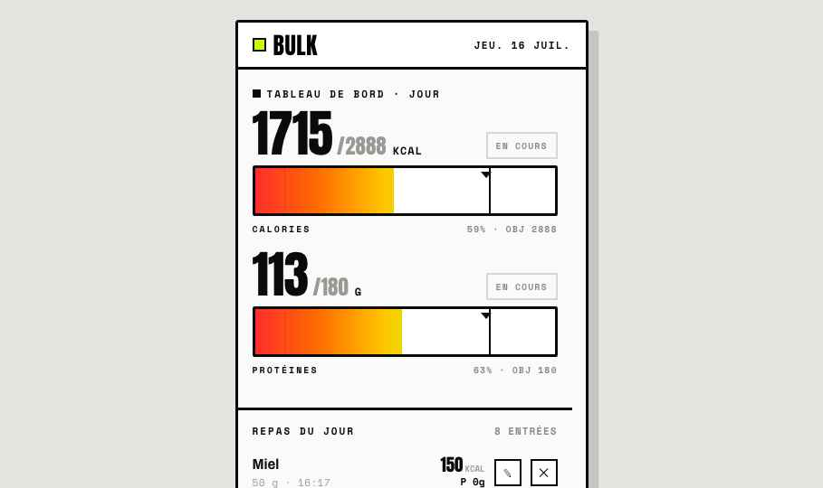
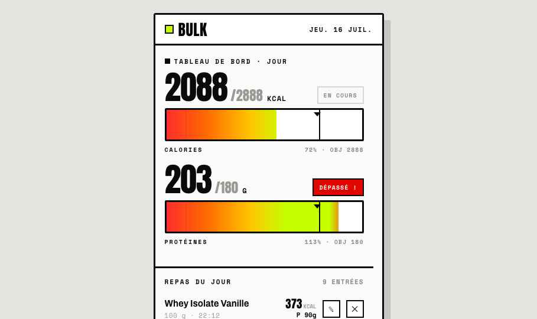

<div align="center">


# BULK

**Tracker de nutrition gamifié pour la prise de masse.**

Macros & calories en temps réel, sous forme de barres qui virent du rouge au vert.
Objectif calorique calculé sur le TDEE (Mifflin-St Jeor aujourd'hui, Fitbit demain).
Mobile-first, self-hosted, mono-utilisateur.


</div>

<table>
<tr>
<td width="50%"></td>
<td width="50%"></td>
</tr>
<tr>
<td align="center"><sub>🏠 Tableau de bord — barres gamifiées</sub></td>
<td align="center"><sub>🚨 Dépassement d'objectif</sub></td>
</tr>
</table>

## ✨ Fonctionnalités

- 🎯 **Barres gamifiées** — remplissage animé, dégradé continu rouge → vert, marqueur d'objectif, alerte « DÉPASSÉ ! » au-delà de 110 %.
- 🎉 **Feedback satisfaisant** — confettis + vibration quand un objectif est atteint.
- 🔍 **Recherche OpenFoodFacts** — par nom (avec photos produits) ou **scan code-barres** caméra (ZXing), + saisie manuelle en secours.
- ⚡ **Ajout en 2-3 taps** — quantité avec aperçu live des kcal/protéines, portion par défaut d'OFF.
- 📓 **Journal du jour** — édition / suppression, horodatage.
- 📅 **Historique** — bilan par jour avec indicateur ✅ / ⚠️.
- ⚙️ **Objectifs** — calculés (Mifflin-St Jeor + facteur d'activité + surplus) ou fixés à la main.
- 🔐 **Connexion stylisée** — cookie de session signé (mono-utilisateur).
- 📱 **PWA** — installable sur l'écran d'accueil, mobile-first, thème sombre.

## 🧱 Stack

| Couche | Techno |
|---|---|
| **Backend** | FastAPI · SQLAlchemy 2 · Pydantic v2 · SQLite (1 worker uvicorn) |
| **Frontend** | React + TypeScript + Vite → nginx statique |
| **Reverse proxy** | Caddy (HTTPS auto Let's Encrypt), `/api/*` → backend, reste → SPA |
| **Données** | OpenFoodFacts (recherche + code-barres) |
| **Déploiement** | Docker + Docker Compose |

## 🏗️ Architecture

```
                    ┌─────────── Caddy (HTTPS) ───────────┐
   bulk.domain ───▶ │  /api/*  → backend:8000 (FastAPI)   │
                    │  /*      → frontend:80 (nginx SPA)  │
                    └─────────────────────────────────────┘
                              │                  │
                     SQLite (volume)      OpenFoodFacts
```

```
backend/    FastAPI — auth, settings, entries, food (OFF proxy), summary, fitbit (stub)
frontend/   Vite React TS — Home (écrans state-driven), Login, BarcodeScanner
deploy/     DEPLOY.md + snippet Caddy
design/     export Claude Design (.dc.html) + captures
```

## 🚀 Démarrage rapide

```bash
git clone https://github.com/cmrabdu/bulk.git && cd bulk
cp backend/.env.example backend/.env      # SESSION_SECRET, APP_USERNAME, APP_PASSWORD
docker compose up -d --build
```

Backend sur `127.0.0.1:8798`, frontend sur `127.0.0.1:8799`. Détails et config Caddy :
[`deploy/DEPLOY.md`](deploy/DEPLOY.md).

### Dev local
```bash
cd backend && python -m venv .venv && . .venv/bin/activate && pip install -r requirements.txt
DATABASE_URL=sqlite:///./bulk.db SESSION_SECRET=dev APP_PASSWORD=dev uvicorn app.main:app --reload --port 8798
# autre terminal — le proxy Vite envoie /api vers :8798
cd frontend && npm install && npm run dev
```
Tests backend : `cd backend && pytest`.

## 🔌 API (aperçu)

```
POST   /api/auth/login          GET  /api/settings   ·  PUT /api/settings
GET    /api/food/search?q=      GET  /api/food/barcode/{code}
POST   /api/entries             GET  /api/entries?date=   ·  PATCH/DELETE /api/entries/{id}
GET    /api/summary/today       GET  /api/history
GET    /api/fitbit/status       (stub V1)
```

## 🎨 Design

Direction **néobrutaliste** : Anton / Archivo / Space Mono, aplats noirs, accent citron
`#C6FF00`, bordures 3 px et ombres dures. Conçu avec Claude Design (source dans
[`design/`](design/)) puis porté fidèlement en React.

## 🗺️ Roadmap

- [ ] OAuth Fitbit (TDEE réel du jour) — endpoints déjà en place.
- [ ] Autres macros (lipides / glucides).
- [ ] Graphes de tendance.

## 📄 Licence

[MIT](LICENSE) © cmrabdu
